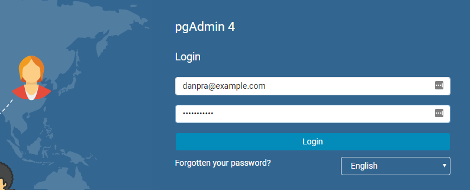
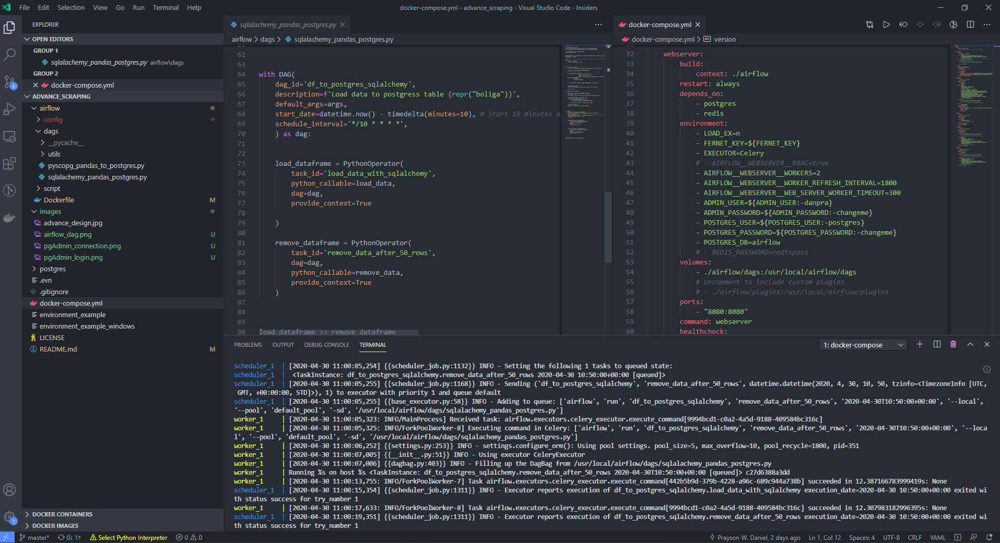

# Advance Web Scraping
> Using airflow to schedule, monitor, and log. Postgres as backend and data storage. Redis as a broker


### Getting Started
Checklist to start our services

- [ ] make sure docker is running, and volume mounting is enabled.
- [ ] git clone [advance_scraping](https://github.com/Proteusiq/advance_scraping.git)
- [ ] set environment variables
- [ ] run the service with a single docker-compose command

### Git Clone
```bash
git clone https://github.com/Proteusiq/advance_scraping.git
cd advance_scraping
```


### Set Environment Variables

Unix users can just edit `.env` contents.
> **WARNING**: Remember to add your .env to .gitignore. Do not share your secrets

Another way for both Unix and Windows. Change the contents of `environment_example` (Unix users) and `environment_example_windows` (Windows users) 

Unix users can do:

```bash
source environment_example
```

Windows users need to `select all` and `copy-paste` to  command-line `cmd.exe`. (PowersShell will not work).

##### Check the environments to be set by docker-compose with:

```bash
docker-compose config
```

See: (docker-compose)[https://docs.docker.com/compose/reference/overview/] options.

### Start services with a single command:

```bash
docker-compose up
```

Note: You can run the services in detach mode. `--detach` or `-d` flag. This will leave services running.
See: [docker-compose up](https://docs.docker.com/compose/reference/up/) options

## UI Services:

- ##### Airflow:  `address:` __localhost:8080__ `default_user:` __danpra__ `default_pwd`: __changeme__
- ##### pgAdmin: `address:` __localhost:5050__ `default_email:` __pgadmin@example.com__ `default_pwd`: __admin__
- ##### Flower: `address:` __localhost:5555__ 

#### Postgres Admin Tool
Head to `localhost:5050`. Login with credentials used in your environment variables. Example: `danpra@example.com` and password `postgrespwd`



Adding a connection to `postgres` DB in `pgAdmin`, click `Add New Server`. Type any name and select `Connection`. Name:Boliga > Host name/address: `postgres`: Postgres Username and Password and click `Save`
  
  


### Stop services with:
Press `Ctrl + C` to stop our services without killing your volumes data. Then do

```bash
docker-compose down
```

Use docker-compose down -v to remove also the volumes. 
> **WARNING**: remember to backup your data before removing volumes. 

```bash
docker-compose down -v
```
See: [docker-compose down](https://docs.docker.com/compose/reference/down/) options
### Web Scraping and Design Pattern [Opinionated Rumbling]
A lazy programmer, like me, loves to write less yet comprehensive codes. (:) Yes, I said it). Design Pattern in Python is not as useful and in most cases, an overkill, as other languages like Java, C#, and C++. In order to design a simple bolig[_danish for estate_] scrapping tool from different estate websites in Denmark, I decided to use a bit of Singleton Pattern and Abstract Factory Pattern.

Bolig (`pipelines.boliger.bolig.Bolig`) ensures that there exists a single instance and single object that can be used by all other bolig related classes. The form of singleton design is Early Instantiation. We create an instance at load time. 

Bolig class also defines an interface[abstract class] for creating families of related objects without specifying their concrete sub-classes[functions]. This ensures consistency among all objects by isolating the client code from implementation. We want to use the same function but with different implementations. `get_page` and `get_pages` will always be called in the same way but the implementation is different.

```python
# inheritance tree
Bolig                   # singleton and abstract
Boliga(Bolig)           # overides get_page and get_pages for boliga.dk api logic
Services(Bolig)         # overides get_page and get_pages for home.dk and estate.dk api logic
BoligaRecent(Boliga)    # initiate with recent boliga as url
BoligaSold(Boliga)      # initiate with sold boliga as url
Home(Services)          # initiate with home recent home as url
Estate(Services)        # initiate with estate recent home as url
```


### Todo:
- [X] Add a web-scraper examples
- [ ] Add simple Airflow examples
- [ ] Add an introduction to Airflow  README
- [ ] Add custom error handling class
- [ ] Add tests Airflow dags and Scrapers



#### Repos that made this project possible and lots of github issues:

 [Docker Apache Airflow](https://github.com/puckel/docker-airflow)


Docker Basics:

Kill all containers
```bash
docker container ps | awk {' print $1 '} | tail -n+2 > tmp.txt; for line in $(cat tmp.txt); do docker container kill $line; done; rm tmp.txt
```
